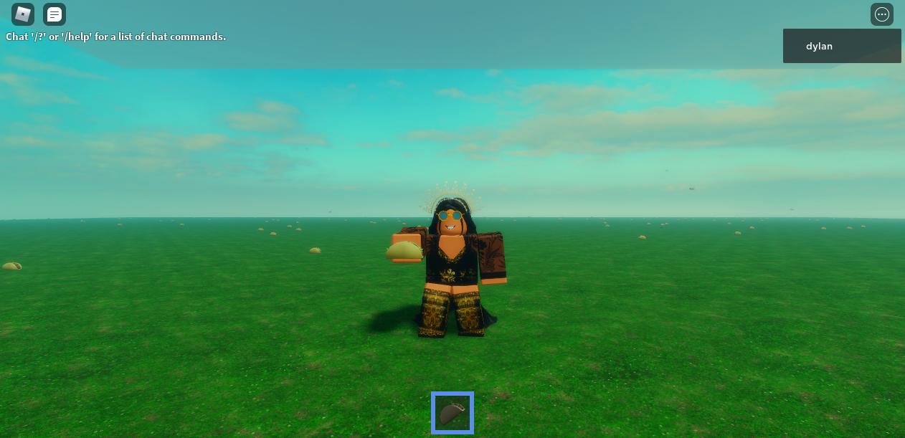

# Raining Tacos
  
Name | Raining Tacos
:-- | :--
Language | Roblox Lua
Age Level | U12
Skill Level | SKILL LEVEL (coach)
Materials | Roblox Studio
Prerequisites | ACADEMIC PREREQUISITES (coach)
Topic | ACADEMIC TOPIC (coach)
Duration | ESTIMATED DURATION
Authors | Daria Calitis
Last Updated | August 9, 2022

# Summary
In this project, you will learn how to use for loops to do repetitive tasks in Lua. Repetitive tasks include spawning numerous tacos! We will make an endless rain of tacos! 🌮

## What you'll learn
  * `Random` Class
  * Loops
  * Roblox Studio Services:
     * Lighting
     * ReplicatedStorage

---

