# Raining Tacos
  
Name | Randomness
:-- | :--
Language | Roblox Lua
Age Level | AGE LEVEL (coach)
Skill Level | SKILL LEVEL (coach)
Materials | Roblox Studio
Prerequisites | ACADEMIC PREREQUISITES (coach)
Topic | ACADEMIC TOPIC (coach)
Duration | ESTIMATED DURATION
Authors | Daria Calitis
Last Updated | TO DO!

# Summary
In this project, you will learn how to use for loops to do repetitive tasks in Lua. Repetitive tasks include spawning numerous tacos! We will make an endless rain of tacos! 🌮


  ## Learning Objectives
  1. Creating Variables
  2. Random Class
  4. Loops
  5. Roblox Services
     * Lighting
     * ReplicatedStorage

---

# Coach Resources

### Roblox Developer
  * Variables: https://developer.roblox.com/en-us/articles/Variables
  * Random Class: https://developer.roblox.com/en-us/api-reference/datatype/Random
  * Loops: https://developer.roblox.com/en-us/articles/Loops
  * Lighting: https://create.roblox.com/docs/reference/engine/classes/Lighting
  * ReplicatedStorage: https://create.roblox.com/docs/reference/engine/classes/ReplicatedStorage

### Completed Game
A copy of the 'Raining Tacos' game is available to download in the 'assets/game' directory of this Repl.it project.

---

# Steps
1. **Setting up the place üå±**
    1. **‚õÖ Changing the atmosphere**
    2. **🌮 Getting our models!**
2. **Making it rain! 🌧️**
3. **Music: ON üîä**

## Step 1: **Setting up the place üå±**
#### Duration: 0:00:00

Before we could make a new weather filled with delicious food, we need to create a new game to start. Opening the Roblox Studio, you should see the home page similar to this:

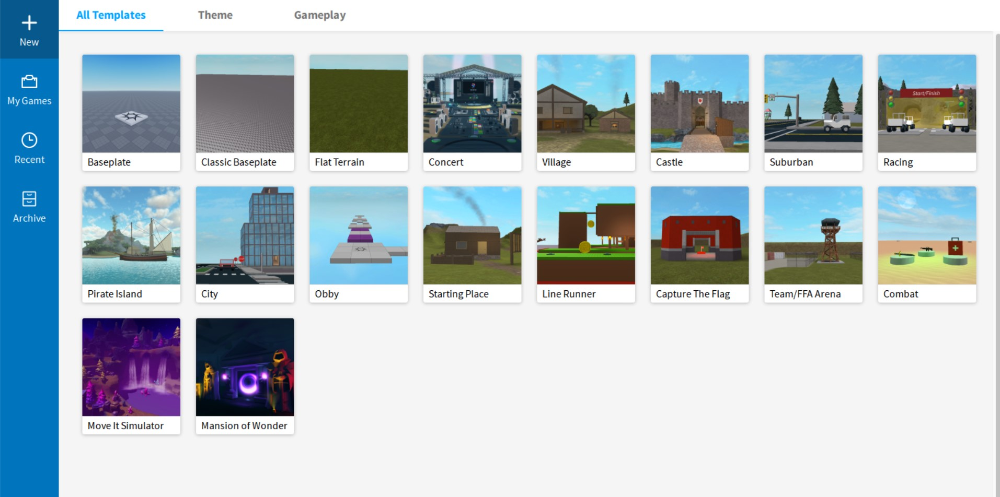

If you are not seeing this page, you should click on the 'New' section on the top left of the screen as seen on the image.

For this project, we will choose the 'Classic Baseplate' template. Clicking on that will generate the place, and it should appear like this:

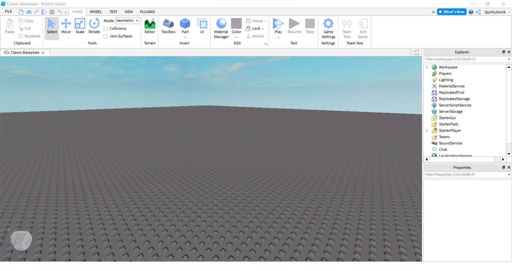

### Step 1.1: **‚õÖ Changing the atmosphere**
Viewing our game, the place is lacking some colour. To change it, we need to click on the '**Baseplate**' part in the **Explorer** window, which can usually be found on the right of the screen.

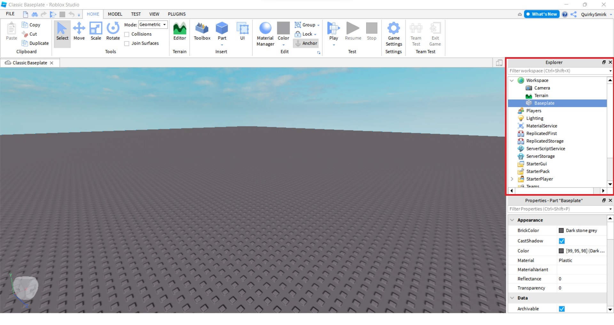

In the Home tab found on the top of the screen, click the down arrow below '**Color**' to select a colour for our baseplate. The baseplate must be selected/highlighted while we change it!


The students are free to choose any colour, but it is recommended to choose a green colour, such as 'Parsley Green', since we transform our baseplate into grass.

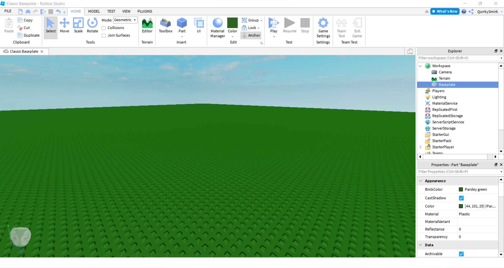

To make it look grass, we must change the material to '**Grass**'. The '**Material Manager**' can be found in the Home tab and in the **Model** tab.

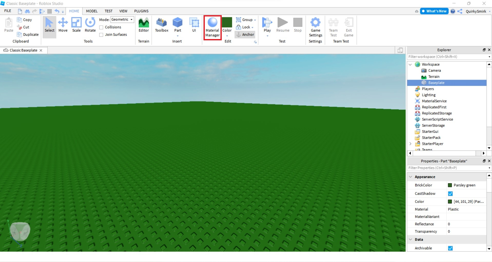

Clicking on it will open a library of different materials such as 'Forcefield' and 'Glacier' at the bottom of the screen. For this project, you will need to select the 'Grass' material among them and click the symbol below it. Make sure that the baseplate is selected!

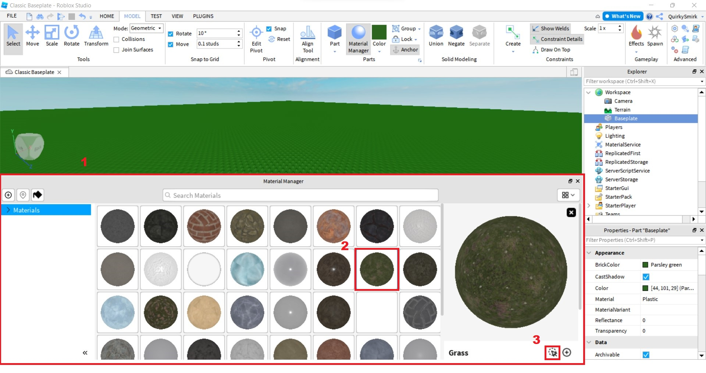

The baseplate should look like this:

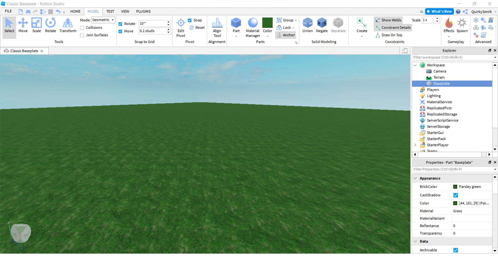

Now that baseplate is done, we should change the '**Lighting**' of the game. It can change the overall feel and look of the game. Like other Roblox Studio services, you can access 'Lighting' through the 'Explorer' window.

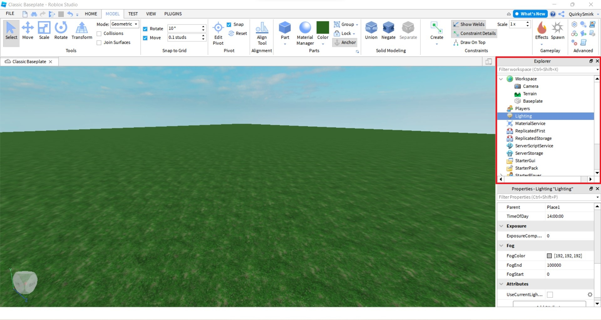

With this service, we can change the time of day through the '**Properties**' window, which is found below the 'Explorer' in the image above, but we will keep the time at '14:00:00'

To create a dream-like filter inside the game, we will need to add the following Objects into 'Lighting':
* Atmosphere
* Sky
* BlurEffect
* BloomEffect
* ColorCorrectionEffect

<br>

These objects will help us brighten up our game! You can add these by hovering over the 'Lighting' service with your cursor and clicking on the '+' button on the right of the name. You can also add them by right-clicking on the service and select '**Insert Object...**'.


You should have something like this in your 'Lighting' service.

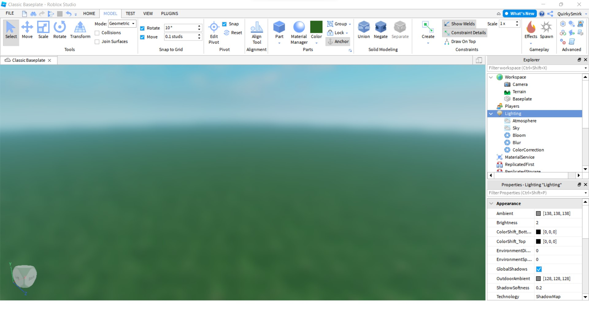

Before we tune the other effects, we need to decrease the intensity of the blur effect so we can see. We can turn it down by clicking on '**Blur**' and go to the 'Properties' window. The property we need to change is '**Size**'; it must be change to `3` or to a lower degree of bluriness.

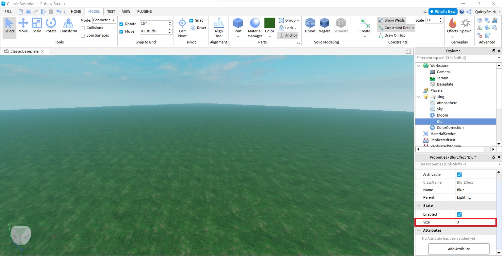

Then, we set the properties of '**Bloom**' to these:
* **Size** -> 56
* **Threshold** -> 0.8

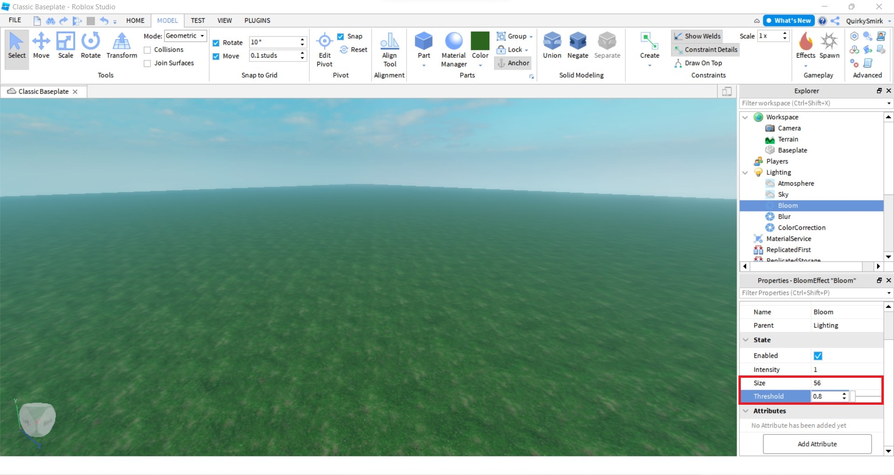

The last change we need to do is '**ColorCorrection**'. For this one, we need to set these properties:
* **Saturation** -> 0.8
* (Optional - RGB Colour Value) **TintColor** -> 228, 236, 191

<br>

The game should look like this:
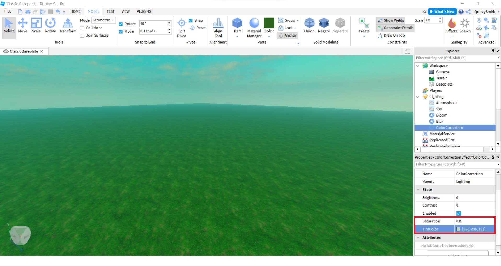

### Step 1.2: **🌮 Getting our models!**
For this, we will need to make a cloud and a taco to make the taco weather. We're going to create a cloud by going through the '**Model**' Tab and click on '**Part**'. You should have a 'Part' appear in your game.

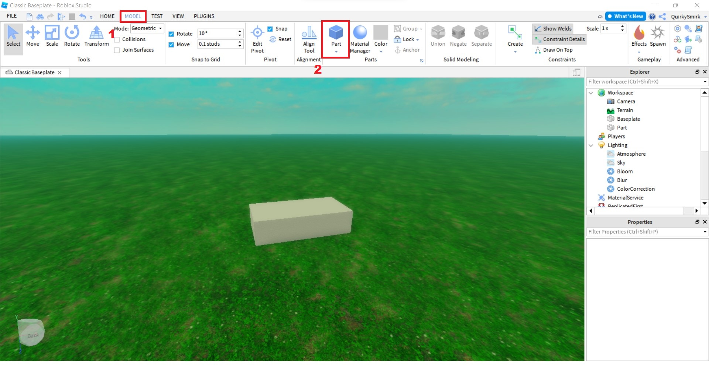

You must then select the 'Part', change its name by right-click on it in the *Explorer*, and select '**Rename**' to make its name '***Cloud***'. Then, you resize it by changing the *Size* to this value, '**512, 20, 512**'. 

Afterwards, you must position the cloud at least 100 studs above the baseplate (Position -> 0, 117.5, 0) and anchor it by pressing the **Anchor** in the Model tab, while it is selected, to keep it in the air. 

You will notice that the place is dark due to the shadow of the part we created. To avoid this, we need to uncheck '**Cast Shadows**' in the properties of the cloud. Finally, we will need to turn off '**CanCollide**', which will prevent the tacos from being trapped above the cloud!

Your place should look like this:

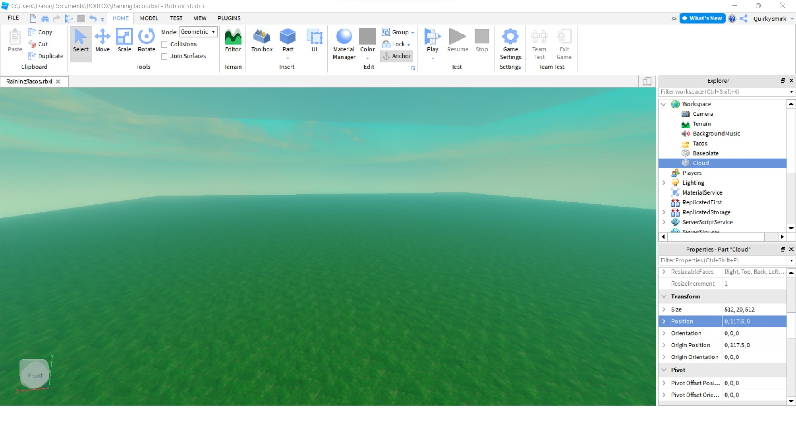

The most important part of this game is the TACO! To get one, we need to open our ***Toolbox*** by going to the **View** tab on top side of our screen.

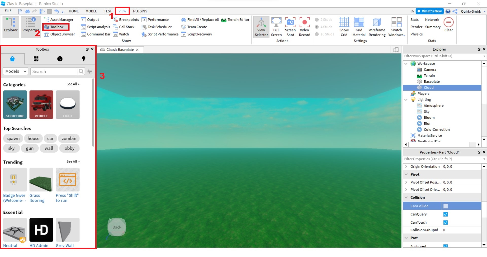

Then, we need to type 'taco' in the search bar of the *Toolbox*, and you should drag the first one to our game.

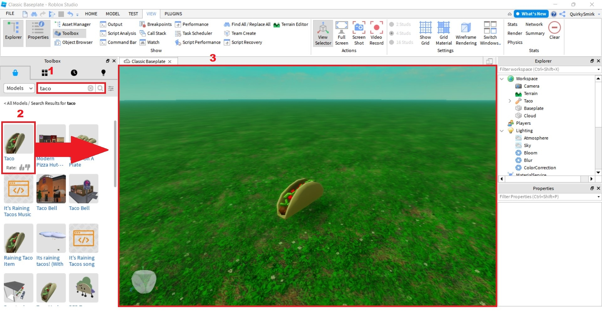

You may have noticed that the taco is not a model... In the *Explorer* window, the **Taco** has a wrench icon beside it. It means that this object is a *Tool*; players can pick up and use this item. These tools are also called gears, which can be bought by users in the *Avatar Shop*.

This taco contains a script that determines its use. We will modify the tool that will be useful later this project. You can find *Taco*'s script within it by clicking the arrow beside its icon. Then, double-click the ***SandwichScript*** to open its code.

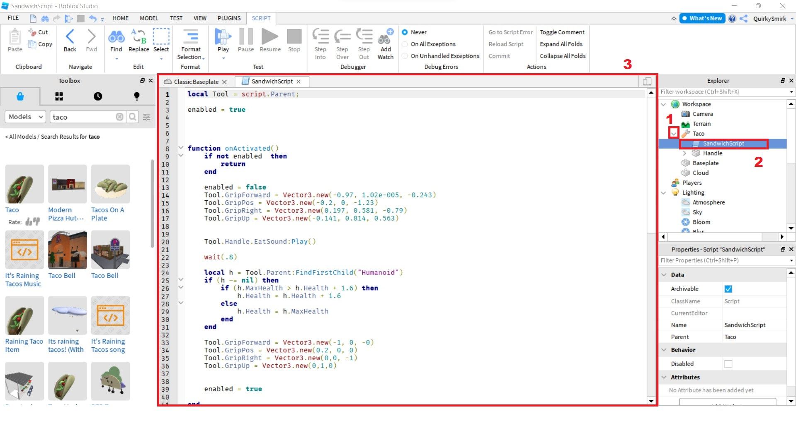

We will replace the following code to the default one. The modifications make the game run smoothly by destroying the tool itself. 

When the player eats the taco, it will destroyed after one use. The taco will also destroyed after 30 seconds once it is placed in the Tacos folder, which we will create later, in the *Workspace*. Finally, the taco will not be destroyed after it is picked by the player. (Comments are made on the modifications.)

```lua
local Tool = script.Parent;

enabled = true

-- This countdown activates when the taco is placed in the game.Workplace.Tacos folder
countdownActivated = false
countdown = 30 -- seconds

function onActivated()
	if not enabled  then
		return
	end

	enabled = false
	Tool.GripForward = Vector3.new(-0.97, 1.02e-005, -0.243)
	Tool.GripPos = Vector3.new(-0.2, 0, -1.23)
	Tool.GripRight = Vector3.new(0.197, 0.581, -0.79)
	Tool.GripUp = Vector3.new(-0.141, 0.814, 0.563)


	Tool.Handle.EatSound:Play()

	wait(.8)
	
	local h = Tool.Parent:FindFirstChild("Humanoid")
	if (h ~= nil) then
		if (h.MaxHealth > h.Health + 1.6) then
			h.Health = h.Health + 1.6
		else	
			h.Health = h.MaxHealth
		end
	end

	Tool.GripForward = Vector3.new(-1, 0, -0)
	Tool.GripPos = Vector3.new(0.2, 0, 0)
	Tool.GripRight = Vector3.new(0,0, -1)
	Tool.GripUp = Vector3.new(0,1,0)


	enabled = true

  -- The taco destroys itself after the player uses it once
	Tool:Destroy()
end

function onEquipped()
	Tool.Handle.OpenSound:play()

 -- The countdown disactivates once it is picked up by the player.
	countdownActivated = false
end

script.Parent.Activated:connect(onActivated)
script.Parent.Equipped:connect(onEquipped)

wait(2)
-- Checks if it is located in Tacos folder inside the game's Workspace. This will activate the countdown.
if Tool.Parent == game.Workspace.Tacos then
	countdownActivated = true	
end

-- The countdown until the taco gets destroyed
while countdownActivated do
	if countdown == 0 then
		Tool:Destroy()
	end
	countdown -= 1
	wait(1)
end
```

With these changes, we will need to place the *Taco* tool inside the game's ***ReplicatedStorage***. Putting it inside this service will disappear the taco from the game's view.

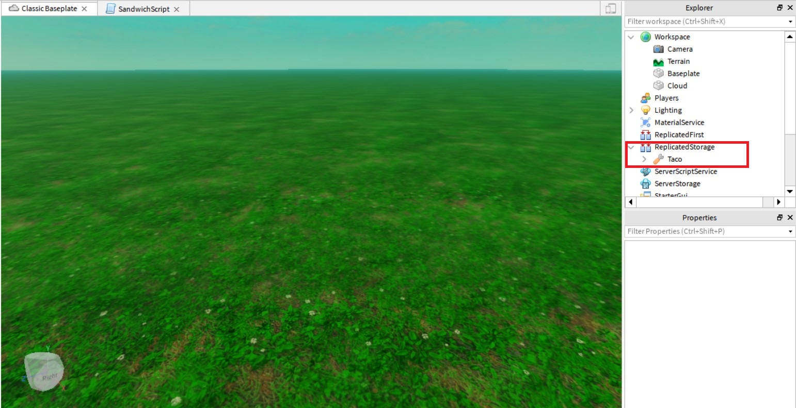

Finally, to keep things tidy, we need to create a ***Folder*** named '**Tacos**' where we will place the clones of our Taco later this project.

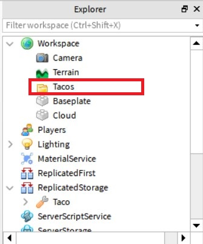

## Step 2: **Making it rain! 🌧️**
#### Duration: 0:00:00

To make it rain tacos, we will need to create a script named **SpawnTacos** within the ***ServerScriptService***. 

```lua
-- Spawn Tacos Script
-- Creates a Random Object to let us generate random numbers
local random = Random.new()

local cloud = game.Workspace.Cloud
local taco = game.ReplicatedStorage.Taco

-- Gets the position of the spawn area for the tacos
local posX = cloud.Position.X
local posY = cloud.Position.Y
local posZ = cloud.Position.Z

-- Gets the size of the spawn area for the tacos
local sizeX = cloud.Size.X
local sizeY = cloud.Size.Y
local sizeZ = cloud.Size.Z


-- This function spawns taco above the spawn area
function spawnTacos()
	local newTaco = taco:Clone()

 -- Acesses the Taco Handle to move the tool (the Tool Object does not have a position property) 
	local tacoHandle = newTaco:WaitForChild("Handle") 
	
	-- Generates the position for the taco
	local newX = random:NextInteger(posX - (sizeX / 2), sizeX / 2)
	local newY = posY
	local newZ = random:NextInteger(posZ - (sizeZ / 2), sizeZ / 2)
	
	-- Sets the new position to the generated one and puts it in the game's workspace
	tacoHandle.Position = Vector3.new(newX, newY, newZ)
	newTaco.Parent = game.Workspace.Tacos
end

-- Spawns tacos endlessly
while true do
	spawnTacos()
	wait(0.01)
end
```

Once you typed this code into the script and placed it correctly like this:

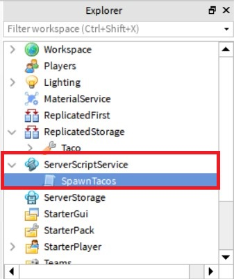

This script will spawn within the area and position of the cloud that we made earlier this guide. Since we unchecked the *CanCollide* property of the part **Cloud**, this will let the tacos fall through it.

To test our game, we will click the '***Test***' tab then the '***Play***' button, found on the top side of the screen!

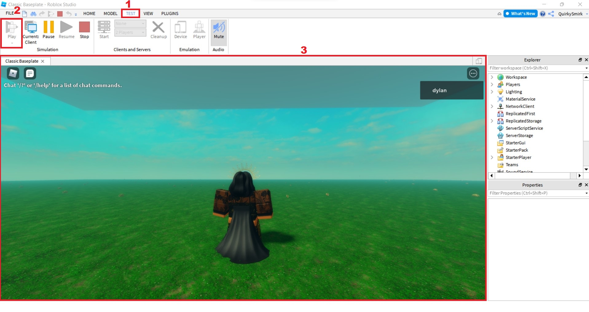

We have created a taco weather! 🌮

## Step 3: **Music: ON üîä**
#### Duration: 0:00:00
All we need to do is fill in the silence of the game by adding some music. We can do that by adding a ***Sound*** Object inside *Workspace*. To keep things organized, we will name the *Sound* Object **BackgroundMusic**.

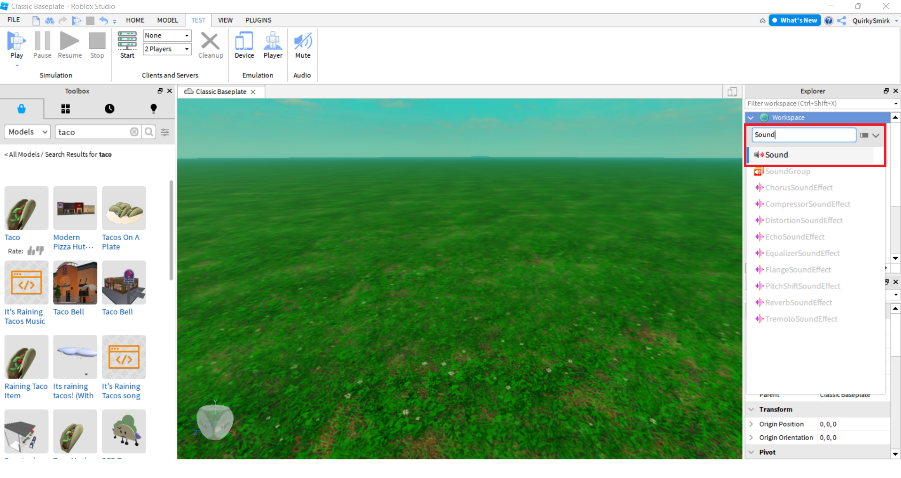

The song that we will add into the game is, of course, the iconic '***Raining Tacos***' song by Parry Gripp!

We can access audios and music through the Roblox website (Follow the images below):

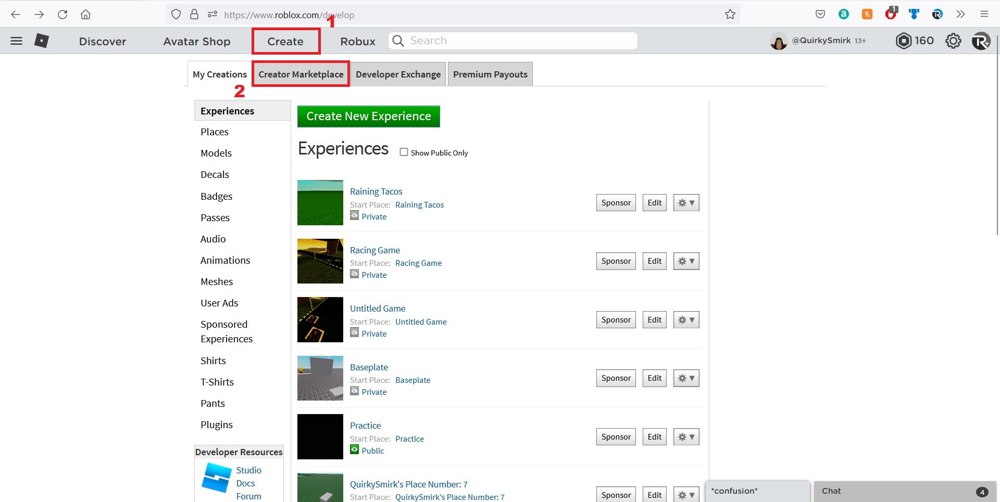

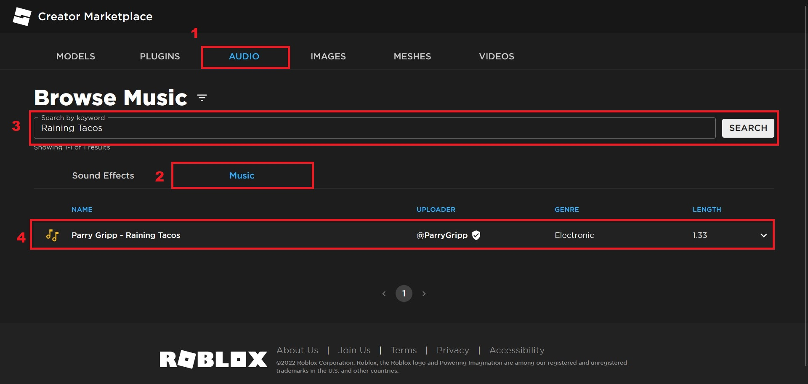

Clicking the song will show a **More Info** button, which you must click. Then, you should end up in a page like this.

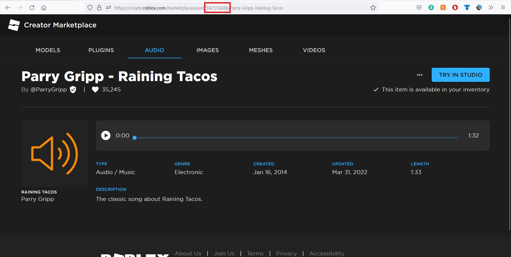

In the image above, you will see the *Sound ID* of the song in the adress bar of your web browser. We need to copy that ID and paste it in the Sound ID property of *BackgroundMusic* Sound Object.

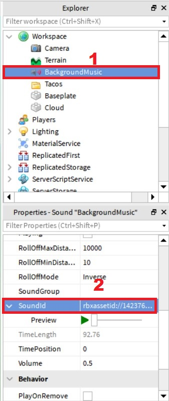

Make sure to check off the Looped and Playing properties so the music plays endlessly in the game!

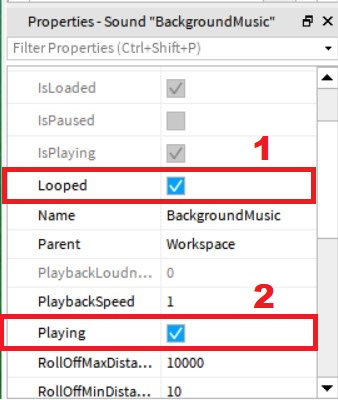

# Conclusion
Congratulations! You should have a fully functioning game filled with delicious and savoury food falling from the sky! You managed to learn about Lua coding and how to navigate the Roblox Studio. Maybe, you should try making taco and burger weather...

> ***NOTE***: Do not forget to save the game! Press Ctrl + S to save it!


**Completed Solution Code**:
<details>
<summary>SandwichScript</summary>
  
  ```lua
  local Tool = script.Parent;
  
  enabled = true
  
  -- This countdown activates when the taco is placed in the game.Workplace.Tacos folder
  countdownActivated = false
  countdown = 30 -- seconds
  
  function onActivated()
  	if not enabled  then
  		return
  	end
  
  	enabled = false
  	Tool.GripForward = Vector3.new(-0.97, 1.02e-005, -0.243)
  	Tool.GripPos = Vector3.new(-0.2, 0, -1.23)
  	Tool.GripRight = Vector3.new(0.197, 0.581, -0.79)
  	Tool.GripUp = Vector3.new(-0.141, 0.814, 0.563)
  
  
  	Tool.Handle.EatSound:Play()
  
  	wait(.8)
  
  	local h = Tool.Parent:FindFirstChild("Humanoid")
  	if (h ~= nil) then
  		if (h.MaxHealth > h.Health + 1.6) then
  			h.Health = h.Health + 1.6
  		else	
  			h.Health = h.MaxHealth
  		end
  	end
  
  	Tool.GripForward = Vector3.new(-1, 0, -0)
  	Tool.GripPos = Vector3.new(0.2, 0, 0)
  	Tool.GripRight = Vector3.new(0,0, -1)
  	Tool.GripUp = Vector3.new(0,1,0)
  
  
  	enabled = true
  
  	-- The taco destroys itself after the player uses it once
  	Tool:Destroy()
  end
  
  function onEquipped()
  	Tool.Handle.OpenSound:play()
  
  	-- The countdown disactivates once it is picked up by the player.
  	countdownActivated = false
  end
  
  script.Parent.Activated:connect(onActivated)
  script.Parent.Equipped:connect(onEquipped)
  
  wait(2)
  -- Checks if it is located in Tacos folder inside the game's Workspace. This will activate the countdown.
  if Tool.Parent == game.Workspace.Tacos then
  	countdownActivated = true	
  end
  
  -- The countdown until the taco gets destroyed
  while countdownActivated do
  	if countdown == 0 then
  		Tool:Destroy()
  	end
  	countdown -= 1
  	wait(1)
end
```
</details>

<details>
<summary>SpawnTacos</summary>
  
  ```lua
  -- Spawn Tacos Script
  local random = Random.new()
  
  local cloud = game.Workspace.Cloud
  local taco = game.ReplicatedStorage.Taco
  
  -- Gets the position of the spawn area for the tacos
  local posX = cloud.Position.X
  local posY = cloud.Position.Y
  local posZ = cloud.Position.Z
  
  -- Gets the size of the spawn area for the tacos
  local sizeX = cloud.Size.X
  local sizeY = cloud.Size.Y
  local sizeZ = cloud.Size.Z
  
  
  -- This function spawns taco above the spawn area
  function spawnTacos()
  	local newTaco = taco:Clone()
  	local tacoHandle = newTaco:WaitForChild("Handle")
  
  	-- Generates the position for the taco
  	local newX = random:NextInteger(posX - (sizeX / 2), sizeX / 2)
  	local newY = posY
  	local newZ = random:NextInteger(posZ - (sizeZ / 2), sizeZ / 2)
  
  	-- Sets the new position to the generated one and puts it in the game's workspace
  	tacoHandle.Position = Vector3.new(newX, newY, newZ)
  	newTaco.Parent = game.Workspace.Tacos
  end
  
  -- Spawns tacos endlessly
  while true do
  	spawnTacos()
  	wait(0.01)
  end
  ```
</details>

## Next Steps

If you want to continue your learning, and try out even more cool features in Roblox Studio, you can head over to their official website and play around them: https://developer.roblox.com/en-us/